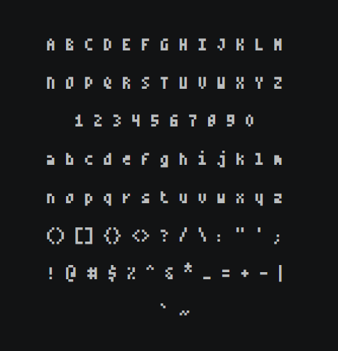
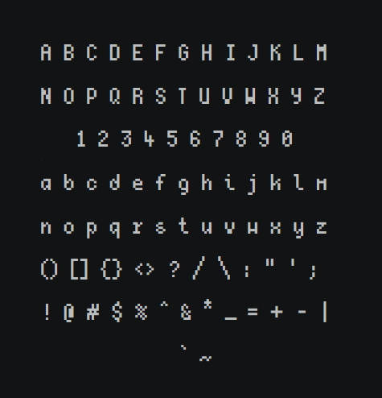

# tini

Fonts created for personal projects, so they only include basic characters.

| Tini4 | Tini5 |
|:---:|:---:|
|  |  |

Two variants, named after their glyph width in pixels:

| | Tini4 | Tini5 |
|---|---|---|
| Glyph width | 4 px | 5 px |
| Total height | 12 px (10 + 2) | 14 px (11 + 3) |
| Glyphs | 327 | 278 |

## Character coverage

- Basic Latin (ASCII)
- Latin-1 Supplement — accented letters, punctuation, symbols (¢ £ © ® ° × ÷ …)
- Vietnamese — full tone + diacritic matrix (Ă Â Ê Ô Ơ Ư Đ and all combinations)
- Arrows (U+2190–U+219B)
- Mathematical operators (∞ ≠ ≡ ≤ ≥ …)


## Editing

Open `src/Tini4.sfd` or `src/Tini5.sfd` in [FontForge](https://fontforge.org).
Switch to the bitmap strike view (`View → Bitmap Strikes Available`) and draw
glyphs in the pixel grid.

To regenerate the SFD scaffolding from scratch (all glyphs will be empty):

```bash
python generate_tini.py
```

## Building

Convert to TTF/BDF using [BitsNPicas](https://github.com/kreativekorp/bitsnpicas):

```bash
java -jar BitsNPicas.jar convertbitmap -f ttf -o dist/Tini4.ttf src/Tini4.sfd
java -jar BitsNPicas.jar convertbitmap -f ttf -o dist/Tini5.ttf src/Tini5.sfd
```

